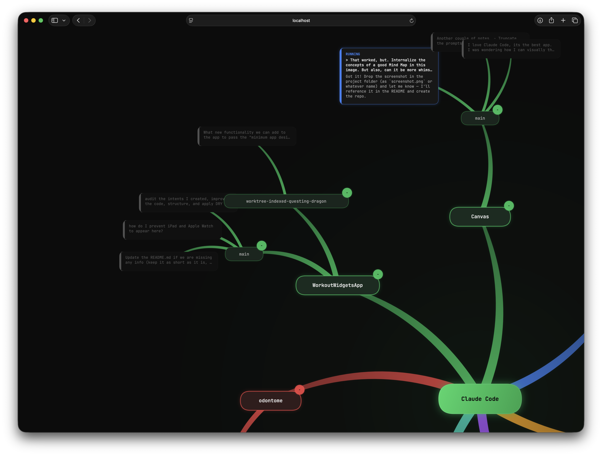

# Claude Code Canvas

A local web app that visualizes your [Claude Code](https://docs.anthropic.com/en/docs/claude-code) sessions as an organic radial mind map.



## Features

- **Radial mind map** — Sessions radiate outward from a central hub, grouped by project and branch
- **Organic tapered branches** — Thick-to-thin flowing connections with per-branch color coding
- **Live updates** — Polls for new session data every 5 seconds without losing your layout
- **Pan, zoom, and drag** — Scroll/trackpad to pan, pinch/Ctrl+scroll to zoom, drag nodes to rearrange
- **Collapse/expand** — Click the badge on any project or branch to collapse its subtree
- **Resume sessions** — Click a session card to open Terminal and resume it with `claude --resume`
- **Worktree support** — Detects and displays sessions running in git worktrees
- **Multi-line cards** — Session cards show the prompt (up to 3 lines) and last AI response (up to 5 lines)

## Setup

Requires [Node.js](https://nodejs.org).

```bash
npm install
npm start
```

Open [http://localhost:3000](http://localhost:3000).

## How it works

The server reads from `~/.claude/history.jsonl` and the per-session JSONL files under `~/.claude/projects/` to build a tree of projects, branches, and sessions. The browser fetches this data, computes a radial layout, and renders everything on an HTML5 Canvas with hardware-accelerated drawing.

## License

[MIT](LICENSE)
